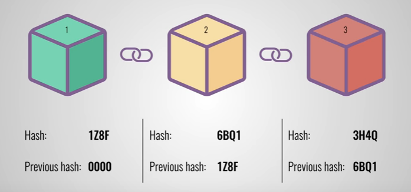

Blockchain é um tema bastante difundido na comunidade e apesar de ser algo revolucionário, no que diz respeito à recursos utilizados, basicamente são tecnologias que já existem há tempos, como sistemas distribuídos, comunicação P2P e criptografia. Quando olha-se pra ela com mais calma, a sensação que fica é de "por que não fizemos isso antes". Neste post, irei desmistificar alguns desses conceitos.

## Do que é feita a blockchain?

O próprio nome já uma uma definição do que se trata: uma cadeia de blocos onde todos os blocos estão interligados:



Os blocos geralmente são constituídos por: suas transações; um hash; e o hash do bloco anterior.
As transações são basicamente informações contidas neste bloco, indo de, informações em textos, snippets de código, no caso dos smart contracts da Ethereum ou até qualquer outra coisa que sua blockchain queira armazenar.
Os blocos têm um tamanho máximo permitido e isso é definido no momento de criação da rede, então, é importante que as transações caibam dentro desse bloco.
Já o hash é uma assinatura única para cada bloco que é gerada através de algum algoritmo de criptografia. Geralmente ela é formada através da combinação entre o hash de cada transação e o hash do bloco anterior.

## Mas como chego nesse hash?
No site do Ubuntu temos um bom exemplo. Nele encontramos as ISOs para [download](http://releases.ubuntu.com/18.04/).
O que acontece quando eu tento gravar essa imagem em um pendrive ocorre um erro? Será que minha ISO está corrompida ou é minha unidade USB que está com problema? Terei que baixar quase 2BG novamente?
Um jeito rápido de descobrir é testando o Checksum do meu arquivo usando o algoritmo MD5, como no seguinte exemplo:

```shell
ms5sum ubuntu-18.04.5-desktop-amd64.iso
f295570badb09a606d97ddfc3421d7bf210b4a81c07ba81e9c040eda6ddea6a0 ubuntu-18.04.5-desktop-amd64.iso
```

Este comando irá ler byte a byte do arquivo e gerar uma assinatura usando o algoritmo MD5, de tal forma que, se um único detalhe for alterado, a assinatura de saída será algo completamente diferente.
Feito isso, basta eu comparar a assinatura gerada com a assinatura disponível no [site](http://releases.ubuntu.com/18.04/SHA256SUMS) do Ubuntu:

```shell
f295570badb09a606d97ddfc3421d7bf210b4a81c07ba81e9c040eda6ddea6a0 *ubuntu-18.04.5-desktop-amd64.iso
3756b3201007a88da35ee0957fbe6666c495fb3d8ef2e851ed2bd1115dc36446 *ubuntu-18.04.5-live-server-amd64.iso
```

Neste caso, eu consigo garantir que minha ISO é exatamente igual à disponível para download.
Para entender melhor tudo isso, vamos construir nossa própria blockchain.

## Construindo a Blockchain

Primeiramente, vamos definir nossa transação. Para isso, criamos uma classe chamada Transaction que terá um conteúdo no formato texto, ou seja, uma String.
Também iremos sobrescrever o método hashCode, para que ele retorne o valor hash da String “content”:

```java
public class Transaction {

   private final String content;

   @Override
   public int hashCode() {
       return content.hashCode();
   }
}
```

Agora vamos definir nosso bloco. Ele deverá ter uma lista de transações, um valor de hash e o valor do hash do bloco anterior.
Para simplificar um pouco as coisas, vamos usar o próprio hash que o Java nos fornece, que é um valor int. Também iremos marcar atributos como final, para tornar nossa blockchain imutável, ficando assim:

```java
public class Block {
   private final List<Transaction> transactions;
   private final int hash;
   private final int previousBlockHash;
}
```

Para criar um bloco, então, devemos informar a lista de transações e o bloco anterior, do qual utilizaremos seu hash, desta forma, o construtor terá esses parâmetros.

```java
public Block(List<Transaction> transactions, Block previousBlock) {
   this.transactions = new ArrayList<>(transactions);
   this.previousBlockHash = previousBlock.hash;
   this.hash = Arrays.hashCode(new Object[] { transactions, this.previousBlockHash });
}
```

Aqui, vale uma observação. O primeiro bloco de uma blockchain, chamado de Genesis Block, não possui valor do hash bloco anterior, já que esse bloco não existe. Então, ele deve ser *hard coded*, com informações das primeiras transações.
Vamos criar um construtor privado e um método estático que retorna nosso Genesis Block e seu valor de hash será criado com base somente no hash das transações:

```java
private Block(List<Transaction> transactions) {
   this.transactions = new ArrayList<>(transactions);
   this.previousBlockHash = 0;
   this.hash = transactions.hashCode();
}

public static Block createGenesisBlock(List<Transaction> transactions) {
   return new Block(transactions);
}
```

Um detalhe apenas para o getter de transações, nele retornaremos uma nova lista, para garantir que a nossa continue imutável:

```java
public List<Transaction> getTransactions() {
   return new ArrayList<>(transactions) ;
}
```

Agora para ver como funciona nossa blockchain. Vamos criar uma classe de teste:

```java
public class BlockChainTest {

   @Test
   public void blockChainTest() {
       Transaction firstTransaction = new Transaction("My first transaction ever!");
       Block genesisBlock = Block.createGenesisBlock(Arrays.asList(firstTransaction));

       System.out.println("Genesis block hash: " + genesisBlock.getHash());
   }
}
```

Ao executar esse teste, a saída no console que obtivemos será Genesis block hash: `-209303716`.
Então vamos criar um assert esperando esse valor:

```java
Assert.assertEquals(genesisBlock.getHash(), -209303716);
```

Vamos fazer uma pequena alteração, removendo o ponto de exclamação de nossa transação e re-executar o teste.
Observe que apenas um caractere fez com que o valor do hash mudasse completamente:

```shell
java.lang.AssertionError:
Expected :-1253677693
Actual   :-209303716
```

Retornando o ponto de exclamação na nossa transação, vamos criar nosso segundo bloco e já lhe adianto que o hash gerado será `1258751948`:

```java
Transaction secondTransaction = new Transaction("129292a182136a35e1f89c586dbac2e2");
Block secondBlock = new Block(Arrays.asList(secondTransaction), genesisBlock);
Assert.assertEquals(secondBlock.getHash(), 1228451966);
```

Aqui, nossa blockchain já assume o comportamento padrão: cada bloco terá suas transações e o valor do hash do bloco anterior, que é interceptado dentro do nosso construtor.
Nossa transação contém o número do hash checksum MD5 da ISO do Ubuntu 18.04, aquela mesma que usei como exemplo a pouco.
Sem mais delongas, vamos criar nosso terceiro bloco.

```java
Block thirdBlock = new Block(Arrays.asList(
    new Transaction("http://releases.ubuntu.com/18.04/ubuntu-18.04-desktop-amd64.iso"),
    new Transaction("http://releases.ubuntu.com/18.04/ubuntu-18.04-desktop-amd64.iso.torrent")), secondBlock);

Assert.assertEquals(thirdBlock.getHash(), -1716700900);
```

Observe que criamos um bloco com duas transações, o que é totalmente permitido.
Lembre-se: um bloco pode ter quantas transações você quiser, desde que seja respeitado o limite máximo de cada bloco.
Nessas duas transações, foram incluídas URLs para download da ISO do Ubuntu. Como o hash é gerado com base no hash do bloco anterior, uma alteração nos primeiros blocos quebraria todos os testes subsequentes.
Você pode conferir o código completo [aqui](https://github.com/alancesar/blockchain).

## Conclusão

Temos um exemplo real de uma blockchain rodando em uma instância, porém, ela tem o poder de ser descentralizada, isto é, ele não existe em apenas em um lugar, ou seja, nosso código pode rodar em dezenas ou até centenas de máquinas.
Sempre que um bloco surge com novas transações, esse bloco é replicado por toda a rede e cada nó da blockchain passa a ter as mesmas informações.
Se supostamente, alguma pessoa má intencionada alterasse as URLs e o checksum de nossa ISO por de uma outra imagem não confiável, isso alteraria o valor do hash de toda a cadeia subsequente. Porém, para seu plano audacioso funcionar, ele teria que fazer essa alteração em pelos menos 51% de nossas instâncias.
É assim que a blockchain consegue ser tão confiável. Diferente de um banco de dados centralizados, onde as informações estão armazenadas em um só lugar, a rede blockchain é distribuídas entre diversos servidores.
Uma rede blockchain pode ser privada, onde somente determinados servidores têm acesso, ou pública, onde cada um pode baixar para si uma cópia, como é o caso do Bitcoin, porém, o princípio da descentralização sempre existirá.
