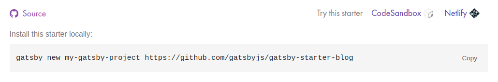

Se você leu o rodapé desta página, percebeu que ela foi feita usando o [Gatsby](https://www.gatsbyjs.com/). Essa ferramenta foi uma das minhas gratas surpresas em 2020.

Eu queria dar uma repaginada no meu blog e, por coincidência, estava estudando algumas tecnologias que me inspiraram a começar algo do zero. A ideia era escrever um artigo com a sintaxe do [Markdown](https://www.markdownguide.org/getting-started/) que fosse renderizado em uma página HTML usando o [Handlebars](https://handlebarsjs.com/) ou algo do tipo. Como toda as outras ideias de rescrever algo do zero, esse projeto fracassou. Mas enfim, me perguntei se mais alguém já não havia pensando nisso, que a princípio parecia ser algo tão promissor. E a resposta foi sim. Acabei chegando ao [Hugo](https://gohugo.io/), mas parecia ser algo cru demais para o que eu tinha em mente. Até que descobri o Gatsby.

O Gatsby é na verdade um amontoado de bibliotecas que gera um conteúdo estático a partir de um projeto React. Há um ecossistema de plugins muito rico que permite adicionar funcionalidades ao seu site de maneira fácil, tudo muito integrado.

Há diversas formas de carregar o conteúdo do site, mas a mais popular é utilizando o [GraphQL](https://graphql.org/) lendo arquivos Markdown, na qual seu conteúdo e [metadados](https://www.gatsbyjs.com/docs/how-to/routing/adding-markdown-pages/#frontmatter-for-metadata-in-markdown-files) serão transformado em [HTML](https://www.gatsbyjs.com/docs/how-to/routing/adding-markdown-pages/#transform-markdown-to-html-and-frontmatter-to-data-using-gatsby-transformer-remark).

Se o seu projeto estiver versionado no GitHub, você ainda pode conectar seu repositório ao [Netlify](https://www.netlify.com/), no qual você terá disponível, além da hospedagem, build e deploy automatizados. É possível incluir também, neste pacote, o [Netlify CMS](https://www.netlifycms.org/), que permite a edição e publicação de seus artigos através de uma interface web, ao invés de ter que manipular diretamente um arquivo Markdown. Como o conteúdo gerado são apenas arquivos estáticos, fica fácil hospedar seu projeto, caso prefira, em sites como o [Surge](https://surge.sh/). Aliás, já mencionei que tudo isso é de graça?

A documentação do Gatsby é muito boa, então não irei entrar em muitos detalhes, mas fica aqui um passo a passo pra você ter seu blog no ar em 15 minutos (na real, eu não cronometrei, mas creio que não fuja muito disso).

## Starters

O Gatsby tem o que ele chama de [starters](https://www.gatsbyjs.com/starters/?). São projetos *templates* dos quais você já pode clonar o repositório e deixar com a sua cara. Após escolher o modelo que mais lhe agrada, para não perder muito tempo, você pode procurar a sessão *Try this starter,* dentro da própria página do Gatsby, e clicar na opção *Netlify.*



Algumas configurações depois, você vai escolher um nome para o repositório. O Netlify vai criá-lo dentro da sua conta do GitHub (ou outro site de versionamento que você tenha escolhido). Eu recomendo deixar esse repositório privado, porque como será uma página exposta na internet, talvez você não queira alguém bisbilhotando. Paralelamente a isso, vai iniciar um deploy e disponibilizar uma URL dentro do domínio da plataforma. Clone esse repositório em sua máquina e, utilizando seu editor favorito (o meu é o [VSCode](https://code.visualstudio.com/)), procure o arquivo `gatsby-config.js`. Nele você encontrará algumas informações que talvez faça sentido alterar, como seu nome, título do site, redes sociais etc.

```jsx
module.exports = {
  siteMetadata: {
    title: `Blog do Alan`,
    author: {
      name: `Alan Cesar`,
      summary: `engenheiro de software, fotógrafo de planta e músico frustrado`,
    },
    description: `Nem sempre falo tudo o que penso, por isso comecei a escrever.`,
    siteUrl: `https://alancesar.com/`,
    social: {
      twitter: `itsmealancesar`,
    }
    // ...
}
```

Feito isso, talvez você queira verificar as mudanças. Para tal, é necessário baixar as dependências usando o `npm` (ou `yarn`) e instalar o [Gatsby CLI](https://www.gatsbyjs.com/docs/reference/gatsby-cli/).

```bash
npm install # ou yarn
npm install -g gatsby-cli
```

Tudo pronto? Então é só iniciar o Gatsby no modo desenvolvimento. Ele vai hospedar seu projeto localmente em `http://localhost:8000` com hot-reloading de suas alterações.

```bash
gatsby develop
```

## Netlify CMS

Como eu disse, também é possível usar o Netlify CMS para gerenciar o conteúdo do site. Alguns starters já possuem suporte (você pode consultar na sessão *Features*), porém ele é facilmente incluído através de um plugin.

```bash
npm install netlify-cms-app gatsby-plugin-netlify-cms --save
```

Também é preciso declarar o plugin no `gatsby-config.js`.

```jsx
module.exports = {
  // Muito provavelmente seu arquivo já terá uma lista de plugins declarado.
  plugins: [`gatsby-plugin-netlify-cms`],
}
```

O próximo passo é criar um arquivo `config.yml` dentro de `static/admin`. Nele será definido algumas coisas, como em qual repositório e branch os arquivos estão versionados e quais campos formarão os elementos de sua página. A opção `widget` permite adicionar componentes de calendário e um editor de texto, já aplicando a formatação no Markdown. Ele vai ficar mais ou menos assim, mas você pode conferir todas as opções na [documentação](https://www.netlifycms.org/docs/add-to-your-site/#configuration):

```yaml
backend:
  name: github
  repo: alancesar/alancesar-com
  branch: main # ou master

media_folder: static/assets
public_folder: /assets

collections:
  - name: blog
    label: Blog
    folder: content/blog
    create: true
    slug: index
    path: "{{title}}/index"
    editor:
      preview: false
    fields:
      - { label: Título, name: title, widget: string }
      - { label: Data de Publicação, name: date, widget: datetime }
      - { label: Descrição, name: description, widget: string }
      - { label: Corpo, name: body, widget: markdown }
```

Feito isso, basta acessar `http://localhost:8000/admin` e seguir os passos para configuração de login. O mesmo vale para seu projeto hospedado no Netlify, mas será necessário configurar um OAuth Provider no GitHub mas calma, é só seguir [estes](https://docs.netlify.com/visitor-access/oauth-provider-tokens/) passos e depois adicionar as chaves em `https://app.netlify.com/sites/{NOME-DO-SEU-SITE}/settings/access#oauth`.

## Hospedagem, CI/CD e DNS

Quase esquecemos, mas seu site já deve estar no ar, porém como um versão antiga. Todo `push` na branch `master` (ou `main` ou até outra que você tenha configurado em `https://app.netlify.com/sites/{NOME-DO-SEU-SITE}/settings/deploys`) irá gerar um novo deploy e atualizar o conteúdo. Porém, use-o com sapiência, já que o plano gratuito possui um número limitado (porém suficiente) de deploys por mês. Talvez você já queira fazer um `commit` e `push` das suas últimas mudanças.

Agora restará apenas configurar o DNS do seu site, para que você não tenha que postar no LinkedIn aquela URL bizarra que o Netlify te deu. Eu uso o [Google Domains](https://domains.google/), mas os passos de configuração são quase sempre os mesmos. Basicamente você vai precisar configurar seu domínio para apontar para os endereços do [Netlify DSN](https://docs.netlify.com/domains-https/netlify-dns/delegate-to-netlify/) e todo o gerenciamento pode ser feito por ele ou, se preferir, mapear os registros `CNAME` e `A`. E de brinde, você tem domínio HTTPS.

## Próximos passos

Se você já possui certo conhecimento nessas tecnologias inclusas no Gatsby, não será complicado personalizar ainda mais o site. O CLI do Gatsby tem alguns [comandos](https://github.com/gatsbyjs/gatsby/blob/master/packages/gatsby-cli/README.md#gatsby-cli) que podem ser úteis e você pode encontrar [plugins](https://www.gatsbyjs.com/plugins) interessantes como integração com o [Disqus](https://www.gatsbyjs.com/plugins/gatsby-plugin-disqus/), [Google Analytics](https://www.gatsbyjs.com/plugins/gatsby-plugin-google-analytics) e até o [Shopify](https://www.gatsbyjs.com/plugins/gatsby-source-shopify). Já o Netlify oferece diversas configurações, como disponibilizar um subdomínio para rodar uma branch de testes. Talvez eu volte aqui para entrar no detalhe de algum deles 🙂
