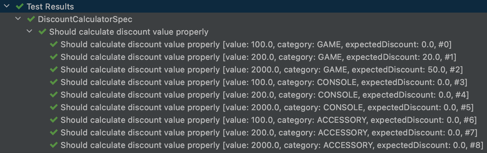
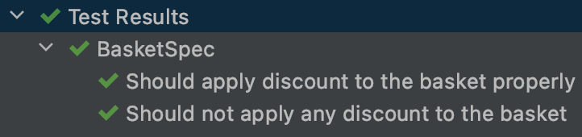

> Após algum tempo, você vai perceber que ter não é tão agradável como querer. Não é lógico, mas é normalmente verdade.
– Spock (1967)

Testes unitários são um negócio chato e quem diz o contrário é porque quer se dar bem na entrevista. Pensando nisso, foi criado o [Spock Framework](http://spockframework.org) e muito provavelmente esse nome é uma homenagem ao personagem de [Star Trek](https://www.cnet.com/pictures/20-reasons-why-star-trek-is-better-than-star-wars-pictures/).

## No final das contas, é tudo JAR

> Uma pessoa pode começar remodelando a paisagem com apenas uma flor, Capitão.
– Spock (1991)

O Spock é uma framework de testes (até aqui, nenhuma novidade) feito em [Groovy](https://groovy-lang.org) que, pra quem não conhece, é uma linguagem de programação que dispensa o uso de ponto e vírgula e roda em cima da [JVM](https://en.wikipedia.org/wiki/Java_virtual_machine) e, na minha opinião, dá ao Java uma carinha de [JavaScript](https://developer.mozilla.org/pt-BR/docs/Web/JavaScript), mas não apenas isso. O bom dele é que, por no final das contas, gerar o mesmo executável, você pode manter tanto código Java quanto Groovy no seu projeto que eles compilarão da mesma maneira. O Groovy, aliás, interpreta (muito bem, obrigado) classes Java e por isso você não precisa sair reescrevendo seu projeto inteiro para começar utilizá-lo.

## Tá, mas e na prática?

Bom, o que você vai precisar aqui é criar um projeto usando seu gerenciador de dependências favorito, que no meu exemplo foi o [Maven](https://maven.apache.org), mas se você preferir, pode ver como ficou lá no meu [GitHub](https://github.com/alancesar/hello-spock).

```xml
<?xml version="1.0" encoding="UTF-8"?>
<project xmlns="http://maven.apache.org/POM/4.0.0"
         xmlns:xsi="http://www.w3.org/2001/XMLSchema-instance"
         xsi:schemaLocation="http://maven.apache.org/POM/4.0.0 http://maven.apache.org/xsd/maven-4.0.0.xsd">

    <modelVersion>4.0.0</modelVersion>

    <groupId>dev.alancesar</groupId>
    <artifactId>hello-spock</artifactId>
    <version>1.0-SNAPSHOT</version>

    <dependencies>
        <dependency>
            <groupId>org.codehaus.groovy</groupId>
            <artifactId>groovy</artifactId>
            <version>3.0.7</version>
        </dependency>

        <dependency>
            <groupId>javax.xml.bind</groupId>
            <artifactId>jaxb-api</artifactId>
            <version>2.4.0-b180830.0359</version>
        </dependency>

        <dependency>
            <groupId>org.spockframework</groupId>
            <artifactId>spock-core</artifactId>
            <version>2.0-M4-groovy-3.0</version>
            <scope>test</scope>
        </dependency>
    </dependencies>

    <properties>
        <maven.compiler.source>15</maven.compiler.source>
        <maven.compiler.target>15</maven.compiler.target>
    </properties>

</project>
```

O que temos aqui é:

- Groovy (versão estável mais recente de quando escrevi essa postagem);
- JAXB 2, que é uma API do Java EE e parou de ser distribuída junto ao JRE a partir do Java 9;
- Spock Framework;
- Instruções pro Maven compilar tudo no Java 15 (porém, essa versão do Spock já roda a partir do Java 8)

## Nossa lojinha de games

> É curioso como vocês humanos conseguem tantas vezes obter aquilo que não querem.
– Spock (1968)

Para provar que esse tal do Spock funciona, vamos fazer nossa lojinha de games, que terá implementada um item, um carrinho de compras e nada mais. Primeiro, vamos criar um enumerador com algumas categorias:

```java
package dev.alancesar.store;

public enum Category {
    CONSOLE,
    GAME,
    ACCESSORY
}
```

Agora, nosso item, que vai ter um nome, um preço e uma categoria:

```java
package dev.alancesar.store;

import java.math.BigDecimal;

public class Item {

    private final String name;
    private final BigDecimal price;
    private final Category category;

    public Item(String name, BigDecimal price, Category category) {
        this.name = name;
        this.price = price;
        this.category = category;
    }

    public String getName() {
        return name;
    }

    public BigDecimal getPrice() {
        return price;
    }

    public Category getCategory() {
        return category;
    }
}
```

E, por fim, nosso carrinho de compras que, a princípio, só precisa ter opção de incluir itens:

```java
package dev.alancesar.store;

import java.util.ArrayList;
import java.util.Collection;

public class Basket {

    private final Collection<Item> items;

    public Basket() {
        items = new ArrayList<>();
    }

    public Basket addItem(Item item) {
        items.add(item);
        return this;
    }

    public Collection<Item> getItems() {
        return items;
    }
}
```

Porém, nossa loja é muito nova para bater de frente com a Americanas e Submarino, então precisamos ganhar clientes dando desconto em alguns produtos. Vamos criar uma interface que cuida disso:

```java
package dev.alancesar.store;

import java.math.BigDecimal;

public interface DiscountCalculator {
    BigDecimal calculate(Basket basket);
}
```

Quem já se frustrou com alguma promoção sabe que elas são cheias de regras, como limite no desconto, lista restrita de produtos elegíveis, entre outros. E na nossa loja não será diferente. Vamos criar uma calculadora de desconto para uma categoria, onde deve haver um gasto mínimo para ter o desconto, o valor máximo que esse desconto pode chegar e, é claro, o valor do desconto:

```java
package dev.alancesar.store;

import java.math.BigDecimal;
import java.math.RoundingMode;

public class CategoryDiscountCalculator implements DiscountCalculator {
    private final Category category;
    private final BigDecimal minPrice;
    private final BigDecimal maxDiscount;
    private final BigDecimal discountPercentValue;

    public CategoryDiscountCalculator(Category category,
                                      BigDecimal minPrice,
                                      BigDecimal maxDiscount,
                                      BigDecimal discountPercentValue) {
        this.category = category;
        this.minPrice = minPrice;
        this.maxDiscount = maxDiscount;
        this.discountPercentValue = discountPercentValue;
    }

    @Override
    public BigDecimal calculate(Basket basket) {
        var totalPrice = basket.getItems().stream()
                .filter(item -> item.getCategory().equals(category))
                .map(Item::getPrice)
                .reduce(BigDecimal.ZERO, BigDecimal::add);

        if (totalPrice.compareTo(minPrice) < 0) {
            return BigDecimal.ZERO;
        }

        var discount = totalPrice.multiply(discountPercentValue)
                .setScale(2, RoundingMode.HALF_EVEN);

        if (discount.compareTo(maxDiscount) > 0) {
            return maxDiscount;
        }

        return discount;
    }
}
```

Usei algumas expressões lambda e, se você não estiver familiar com elas, recomendo dar uma lida [aqui](https://www.oracle.com/br/technical-resources/articles/java-stream-api.html) antes.

## Hora de testar

> Em momentos críticos, o homem por vezes vê exatamente o que deseja ver.
– Spock (1968)

Como perceberam, nossa calculadora de desconto é cheia das letrinhas miúdas e precisamos testar bem esses cenários. Consequentemente, isso geraria bastante código, mas não com o Spock! Ele possui um recurso chamado [Data Driven](http://spockframework.org/spock/docs/1.3/data_driven_testing.html), que permite escrever vários cenários de teste usando um *Data Table*.

Lá no nosso projeto, em seu diretório de testes, vamos criar uma classe Groovy, a `DiscountCalculatorSpec.groovy`:

```groovy
package dev.alancesar.store

import spock.lang.Specification

class DiscountCalculatorSpec extends Specification {

    def "Should calculate discount value properly"(float price, Category category, float expectedDiscount) {

        given: "a basket with one item"
        def item = new Item("Test Item", new BigDecimal(price), category)
        def basket = new Basket().addItem(item)

        when: "create a discount"
        def calculator = new CategoryDiscountCalculator(
                Category.GAME,
                new BigDecimal(200),  // minPrice
                new BigDecimal(50),   // maxDiscount
                new BigDecimal(0.10)  // discountPercentValue
        )

        and: "calculate this discount with this basket"
        def discount = calculator.calculate(basket)

        then: "discount should be as expected"
        discount == new BigDecimal(expectedDiscount)

        where: "the values are"
        price | category           | expectedDiscount
        100   | Category.GAME      | 0
        200   | Category.GAME      | 20
        2000  | Category.GAME      | 50
        100   | Category.CONSOLE   | 0
        200   | Category.CONSOLE   | 0
        2000  | Category.CONSOLE   | 0
        100   | Category.ACCESSORY | 0
        200   | Category.ACCESSORY | 0
        2000  | Category.ACCESSORY | 0
    }
}
```

O Spock usa o [BDD (Behavior Driven Development)](https://pt.wikipedia.org/wiki/Behavior_Driven_Development) em sua sintaxe, então o que fizemos foi escrever algo como:

- *Dado* um carrinho de compras;
- *Quando* criado um desconto;
- *E* aplicado esse desconto usando esse carrinho;
- *Então* o valor do desconto deve ser o esperado;
- *Onde* os valores sejam estes.

Agora vamos entender esse código, lendo de baixo pra cima. O *where* possui dados tabelados, separados por um pipe (`|`) e com uma linha de cabeçalho. Esse cabeçalho será os nossos parâmetros de entrada do método e cada nova linha, o valor atribuído a eles. O *then* compara um valor obtido com um parâmetro, justamente o valor recebido de nossa tabela. O uso de `assert` ou qualquer coisa do tipo é dispensável no Spock. Todo resultado *booleano* dentro desse bloco será interpretado como uma condição a ser testada. O *when* é onde aplico a lógica a ser validada, o *given* é onde declaro as condições e posso usar o *and* para adicionar mais delas. E sim, a execução do método será repetida para cada linha adicionada à tabela.

O Groovy tem essa palavra chave `def`, que seria o `var` do Java, mas além de variáveis, também é possível declarar métodos que podem ser nomeados com uma `String`, ficando esse nome bem legível para o que estamos testando. Na declaração da classe, basta estender o `spock.lang.Specification` e todos esses recursos já ficam disponíveis e é uma boa prática nomear sua classe de teste com o sufixo `Spec`, de *specification*. Usando o [IntelliJ](https://www.jetbrains.com/pt-br/idea/), ao rodar esses testes, temos uma listagem bem intuitiva do que foi executado:



## Indo um pouco além

> A mudança é um processo essencial a toda a existência.
– Spock (1969)

Vamos dar uma repaginada no nosso carrinho para que ele suporte receber um desconto e realizar cálculo do preço total, mas antes, vamos criar um desconto que na verdade não dá desconto nenhum:

```java
package dev.alancesar.store;

import java.math.BigDecimal;

public class NoDiscount implements DiscountCalculator {
    @Override
    public BigDecimal calculate(Basket basket) {
        return BigDecimal.ZERO;
    }
}
```

A ideia é que esse seja o estado inicial do carrinho, que ficou assim:

```java
package dev.alancesar.store;

import java.math.BigDecimal;
import java.util.ArrayList;
import java.util.Collection;

public class Basket {
    private final Collection<Item> items;
    private DiscountCalculator discount = new NoDiscount();

    public Basket() {
        items = new ArrayList<>();
    }

    public Basket(Collection<Item> items) {
        this.items = items;
    }

    public Basket addItem(Item item) {
        items.add(item);
        return this;
    }

    public Collection<Item> getItems() {
        return items;
    }

    public void applyDiscount(DiscountCalculator discount) {
        if (discount == null) {
            removeDiscount();
            return;
        }

        this.discount = discount;
    }

    public void removeDiscount() {
        this.discount = new NoDiscount();
    }

    public BigDecimal getDiscount() {
        return discount.calculate(this);
    }

    public int getTotalItems() {
        return items.size();
    }

    public BigDecimal getTotalPrice() {
        return items.stream()
                .map(Item::getPrice)
                .reduce(BigDecimal.ZERO, BigDecimal::add)
                .subtract(discount.calculate(this));
    }
}
```

Para testar esses novos cenários, criaremos o `BasketSpec.groovy`, onde vamos usar alguns métodos úteis do Spock. Um deles é o `setup()`, que é invocado a cada execução de um teste:

```groovy
class BasketSpec extends Specification {

    Basket gamerBasket

    def setup() {
        def items = [
                new Item("Call of Duty", new BigDecimal(200), Category.GAME),
                new Item("PlayStation 5", new BigDecimal(4400), Category.CONSOLE),
                new Item("Dualsense", new BigDecimal(400), Category.ACCESSORY)
        ]

        gamerBasket = new Basket(items)
    }

    // ...
}
```

Feito isso, vamos incluir dois testes: um para verificar se o desconto foi aplicado corretamente ao carrinho e o outro pra ver se não dá nenhum `NullPointerException`:

```groovy
class BasketSpec extends Specification {

	// ...

    def "Should apply discount to the basket properly"() {
        given: "a gamer basket"
        def basket = gamerBasket

        and: "a discount"
        def discount = new CategoryDiscountCalculator(
                Category.GAME,
                new BigDecimal(200),  // minPrice
                new BigDecimal(50),   // maxDiscount
                new BigDecimal(0.10)  // discountPercentValue
        )

        when: "apply the discount to the basket"
        basket.applyDiscount(discount)

        then: "the discount should be as expected"
        with(basket) {
            it.discount == 20
            it.totalItems == 3
            it.totalPrice == (200 + 4400 + 400) - 20
        }
    }

    def "Should not apply any discount to the basket"() {
        given: "a gamer basket"
        def basket = gamerBasket

        when: "remove the discount"
        basket.removeDiscount()

        then: "no one discount should be applied"
        with(basket) {
            discount == 0
            totalItems == 3
            totalPrice == 200 + 4400 + 400
        }
    }
}
```

Aqui temos outro método útil do Spock: o `with`. Ele permite que, dado um objeto, referenciado como `it`, fazer validações dentro de suas propriedades. O Groovy, aliás, interpreta `algumaCoisa` como `getAlgumaCoisa()`. A declaração do `it` é opcional, porém como no primeiro teste já existe a variável `discount` declarada, temos que usá-lo para que o compilador entenda que queremos chamar o atributo de `basket` ao invés da instância de `DiscountCalculator`, ou seja:

```groovy
basket.discount == 20
```

É o mesmo que:

```groovy
with(basket) {
  it.discount == 20
}
```

Que também pode ser:

```groovy
with(basket) {
  discount == 20
}
```

Como saída temos:



E o método `setup()` foi chamado a cada execução. Se você duvida, adicione um log:

```groovy
def setup() {
    def items = [
            new Item("Call of Duty", new BigDecimal(200), Category.GAME),
            new Item("PlayStation 5", new BigDecimal(4400), Category.CONSOLE),
            new Item("Dualsense", new BigDecimal(400), Category.ACCESSORY)
    ]

    gamerBasket = new Basket(items)
    System.out.println('just created a gamer basket!')
}
```

E observe o console:

```bash
just created a gamer basket!
just created a gamer basket!

Process finished with exit code 0
```

Além do `setup()` temos também o `cleanup()`, que é invocado ao final de cada execução. Há também o `setupSpec()` e `cleanupSpec()`, que fazem a mesma coisa, mas antes da primeira execução e ao final da última, respectivamente. [Aqui](http://spockframework.org/spock/docs/1.3/index.html) tem mais coisas legais, como opção de mockar métodos e, se tiver paciência, recomendo dar uma passada pela [documentação](http://spockframework.org/spock/docs/1.3/).
