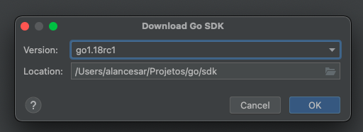

Como todo mundo que trabalha com a linguagem deve saber, o Golang nasceu sem tratamento de tipos [genéricos](https://go.dev/doc/faq#generics).
De fato, não era uma preocupação no momento, afinal, ele nasceu pra ser simples e performático e, infelizmente, esse tipo recurso não ajuda nisso.
Porém, o Go evoluiu para além de pequenas aplicações executando processos pesados e hoje é encontrado em praticamente tudo:
aplicações web, bibliotecas, CLIs e aquilo ignorado durante sua concepção começou a ser sentido pela sua crescente comunidade.

## Afinal, o que são generics?

Se você tem experiência com *generics* em outra linguagem, talvez esse tópico seja redundante, então não ficarei triste pular para o próximo.

Diferente de linguagens baseadas em *script*, como JavaScript e Python, o Go é *[fortemente tipado](https://en.wikipedia.org/wiki/Strong_and_weak_typing)*
(assim como Java, C#, entre outras). Isso significa que toda variável deve ser anotada com o seu tipo: inteiro, *string* e por aí vai.

Pense em uma situação em que você precisa construir uma URL e precisa adicionar parâmetros a ela.
Um jeito simples* seria utilizar o método abaixo (* *Apenas um exemplo, nunca construa URLs assim* 😬).

```go
func AddParam(url, name, value string) string {
	if !strings.Contains(url, "?") {
		url += "?"
	} else {
		url += "&"
	}

	return fmt.Sprintf("%s%s=%v", url, name, value)
}
```

Isso funciona bem para valores do tipo `string`. Mas caso meu parâmetro seja um inteiro, teríamos de escrever outro método:

```go
func AddIntParam(url, name string, value int) string {
	if !strings.Contains(url, "?") {
		url += "?"
	} else {
		url += "&"
	}

	return fmt.Sprintf("%s%s=%v", url, name, value)
}
```

E isso começa a ficar insustentável à medida que novos parâmetros aparecem.

Uma maneira de evitar essa repetição desnecessária de código, que inclusive funciona praticamente desde sempre no Go é usar o tipo `interface{}`:

```go
func AddParam(url, name string, value interface{}) string {
	// Nada muda...
}
```

Porém, isso deixa a abertura de algum desenvolvedor tentar fazer isso. E acredite, algum desenvolvedor vai tentar fazer isso:

```go
type user struct {
	Name string
	Age  int
}

AddParam("www.google.com", "teste", user{
	Name: "Alan",
	Age:  33,
})

// URL gerada: www.google.com?teste={Alan 33}
```

E o resultado pode acabar não sendo o esperado, então seria necessário adicionar algumas verificações:

```go
func AddParam(url, name string, value interface{}) (string, error) {
	switch v := value.(type) {
	case string, int:
		return addValidParam(url, name, value), nil
	default:
		return "", fmt.Errorf("%v is an invalid type", v)
	}
}

func addValidParam(url, name string, value interface{}) string {
	if !strings.Contains(url, "?") {
		url += "?"
	} else {
		url += "&"
	}

	return fmt.Sprintf("%s%s=%v", url, name, value)
}
```

E talvez isso comece a ficar complexo novamente.

Fugindo um pouco do mundo de Golang, no Java, por exemplo, usamos os *generics* para definir uma estrutura de dados em tempo de execução, como, por exemplo, nas listas:

```java
List<User> list = new ArrayList<>();
list.add(new User("Alan", 33));
list.get(0).SomeMethodFromUser()
```

## Usando o Go 1.18

Os *generics* estão disponíveis a partir da versão 1.18 do Go, que até o momento em que escrevo esse post ainda não está disponível oficialmente,
porém não é complicado instalar a versão de testes. Se você utiliza o [Goland](https://www.jetbrains.com/pt-br/go/) ou [IntelliJ](https://www.jetbrains.com/idea/),
basta apenas baixar pela própria IDE:



Ou se preferir, pela própria linha de comando:

```bash
go install golang.org/dl/go1.18rc1@latest
go1.18rc1 download
go1.18rc1 run path/to/file.go
```

Caso esteja utilizado [Go Modules](https://go.dev/blog/using-go-modules), também é preciso configurar o `go.mod` para usar a versão correta:

```
module seu-modulo

go 1.18
```

## Generics no Go

Para não quebrar a compatibilidade da linguagem, a declaração escolhida para tipos genéricos foi a seguinte:

```go
func NomeDoMetodo[NomeDoTipo Tipo](nomeDoPamametro NomeDoTipo) {
	//...
}
```

Confuso? Vamos reescrever nosso `AddParam` usando *generics*:

```go
func AddParam[T any](url, name string, value T) (string, error) {
	switch v := value.(type) {
	case string, int:
		return addValidParam(url, name, value), nil
	default:
		return "", fmt.Errorf("%v is an invalid type", v)
	}
}
```

Segundo a própria documentação, `any` é um sinônimo para `interface{}`:

```go
// any is an alias for interface{} and is equivalent to interface{} in all ways.
type any = interface{}
```

Ou seja, nosso método funciona exatamente como funcionava anteriormente, mas não é exatamente para isso [que foi criado os *generics*](https://go.dev/blog/why-generics).
Podemos definir qualquer tipo, que inclusive podem ser vários, o que nos permitiria remover a validação do parâmetro de entrada.

```go
func AddParam[T string | int](url, name string, value T) string {
	if !strings.Contains(url, "?") {
		url += "?"
	} else {
		url += "&"
	}

	return fmt.Sprintf("%s%s=%v", url, name, value)
}
```

Desta forma, receberíamos um erro em tempo de compilação caso algum parâmetro fuja disso:

```go
AddParam("www.google.com", "teste", user{
	Name: "Alan",
	Age:  33,
})

// Saída no console: user does not implement string|int
```

Declarações de interfaces também receberem esse recurso, o que nos permite fazer coisas do tipo:

```go
type ValidParam interface {
	string | int | float32 // Ou qualquer outro tipo
}

func AddParam[T ValidParam](url, name string, value T) string {
	// Nada muda...
}
```

## E não para por aí

A outra grande vantagem dos tipos genéricos e evitar fazer *cast* excessivo entre tipos. Vamos imaginar uma aplicação que precise executar operações paralelas,
como transferências de arquivos de uma lista de URLs, porém, por limitações do disco e da própria banda, queremos definir um número máximo de *workers* simultâneos.

Entidade `Download`:

```go
type (
	Download struct {
		url string
	}
)

func (d Download) Download(_ context.Context) {
	log.Printf("starting download from %s\n", d.url)

    // Simulando o tempo de download
	ms := rand.Intn(50) * 100
	time.Sleep(time.Millisecond * time.Duration(ms))

  log.Printf("dowloaded from %s successfuly\n", d.url)
}

func NewDownload(url string) Download {
	return Download{
		url: url,
	}
}
```

E o nosso *worker* de download:

```go
type (
	Worker struct {
		buffer int
	}
)

func New(bufferSize int) *Worker {
	return &Worker{
		buffer: bufferSize,
	}
}

func (w Worker) Work(ctx context.Context, items []Download) {
	var wg sync.WaitGroup
	wg.Add(len(items))

	jobs := make(chan Download)

    // Cria um número limitado de workers
	for i := 1; i <= w.buffer; i++ {
		go func() {
			for j := range jobs {
				// Realiza o download
				download.Download(ctx)
				wg.Done()
			}
		}()
	}

	for _, item := range items {
    // Envia um item através de um canal.
    // O primeiro worker que receber processa.
    // Se todos estiverem ocupados, a execução fica presa
    // até algum worker estar disponível.
		jobs <- item
	}

    // Fecha o canal e espera até todos workers ocupados finalizarem.
	close(jobs)
	wg.Wait()
}
```

Funcional e bonito. Porém, isso limita o *worker* a somente lidar com `Downloads`:

```go
func main() {
	n := 20
	downloads := make([]Download, n)

	for i := 0; i < n; i++ {
		downloads[i] = NewDownload(fmt.Sprintf("https://some-item.com?id=%d", i+1))
	}

	w := New(5)
	w.Work(context.Background(), downloads)
}
```

Com alguns ajustes, podemos tornar esse *worker* mais genérico:

```go
package worker

import (
	"context"
	"sync"
)

type (
	Fn func(context.Context, interface{})

	Worker struct {
		fn     Fn
		buffer int
	}
)

func New(workerFn Fn, bufferSize int) *Worker {
	return &Worker{
		fn:     workerFn,
		buffer: bufferSize,
	}
}

func (w Worker) Work(ctx context.Context, items []interface{}) {
	var wg sync.WaitGroup
	wg.Add(len(items))

	jobs := make(chan interface{})

	for i := 1; i <= w.buffer; i++ {
		go func() {
			for j := range jobs {
				w.fn(ctx, j)
				wg.Done()
			}
		}()
	}

	for _, item := range items {
		jobs <- item
	}

	close(jobs)
	wg.Wait()
}
```

E, fazendo os *casts* necessários, temos:

```go
func main() {
	n := 20
	downloads := make([]interface{}, n)

	for i := 0; i < n; i++ {
		downloads[i] = NewDownload(fmt.Sprintf("https://some-item.com?id=%d", i+1))
	}

	downloader := func(ctx context.Context, download interface{}) {
		download.(Download).Download(ctx)
	}

	w := worker.New(downloader, 5)
	w.Work(context.Background(), downloads)
}
```

Funcional, porém nada bonito. Usando *generics*, podemos encapsular toda essa verbosidade dentro do *worker*:

```go
type (
   Fn[T any] func(context.Context, T)

   Worker[T any] struct {
      fn     Fn[T]
      buffer int
   }
)

func New[T any](workerFn Fn[T], bufferSize int) *Worker[T] {
   return &Worker[T]{
      fn:     workerFn,
      buffer: bufferSize,
   }
}

func (w Worker[T]) Work(ctx context.Context, items []T) {
   var wg sync.WaitGroup
   wg.Add(len(items))

   jobs := make(chan T)

   for i := 1; i <= w.buffer; i++ {
      go func() {
         for j := range jobs {
            w.fn(ctx, j)
            wg.Done()
         }
      }()
   }

   for _, item := range items {
      jobs <- item
   }

   close(jobs)
   wg.Wait()
}
```

E nosso método `main()` volta a ser (quase) o que era:

```go
func main() {
   n := 20
   downloads := make([]Download, n)

   for i := 0; i < n; i++ {
      downloads[i] = NewDownload(fmt.Sprintf("https://some-item.com?id=%d", i+1))
   }

   downloader := func(ctx context.Context, download Download) {
      download.Download(ctx)
   }

   w := worker.New(downloader, 5)
   w.Work(context.Background(), downloads)
}
```

Podemos inclusive também escrever listas (não confundir com [arrays e slices](https://www.godesignpatterns.com/2014/05/arrays-vs-slices.html)):

```go
type (
	List[E any] []E
)

func NewList[E any]() *List[E] {
	return &List[E]{}
}

func (l *List[E]) Add(element E) {
	*l = append(*l, element)
}

func (l *List[E]) Get(index int) *E {
	if index > len(*l) {
		return nil
	}

	return &(*l)[index]
}
```

E até adicionar filtros (adeus `for _, item := range items`?):

```go
func (l *List[E]) Find(filter func(*E) bool) *E {
   for index := range *l {
      if filter(&(*l)[index]) {
         return &(*l)[index]
      }
   }

   return nil
}

func main() {
	type user struct {
		Name string
		Age  int
	}

	// Notem que aqui precisamos definir o tipo na inicialização
	// da struct, usando a anotação [user], pois, o compilador
	// não teria como inferir esse valor em tempo de execução.
	list := NewList[user]()
	list.Add(user{
		Name: "Alan",
		Age:  33,
	})

	im33 := list.Find(func(u *user) bool {
		return u.Age == 33
	})

	fmt.Println(im33)
  // Saída no console: &{Alan 33}
}
```

Então é isso, galera. Os *generics* são apenas um dos diversos recursos esperados na versão [1.18](https://tip.golang.org/doc/go1.18)
da linguagem que está prevista para sair ainda esse mês, mas eu chutaria só depois do carnaval 😛.